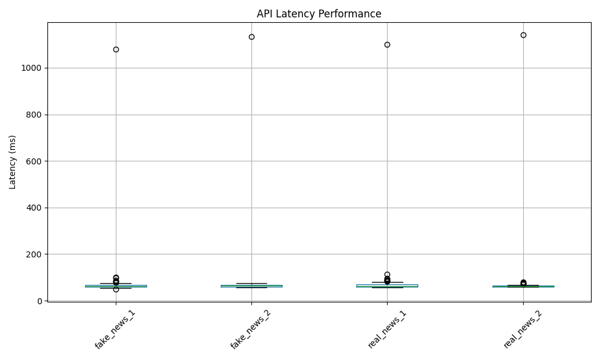
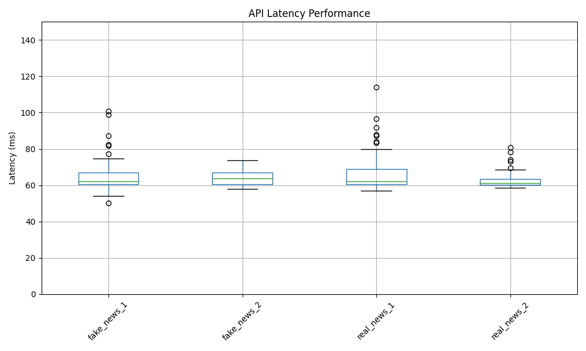

# E444-F2024-PRA5

## boxplot

## boxplot shrinked

since the max vales for each test would be greater than 100, while the rest would be usually less than 150, i add a shrink version like zoom-in the boxplot
